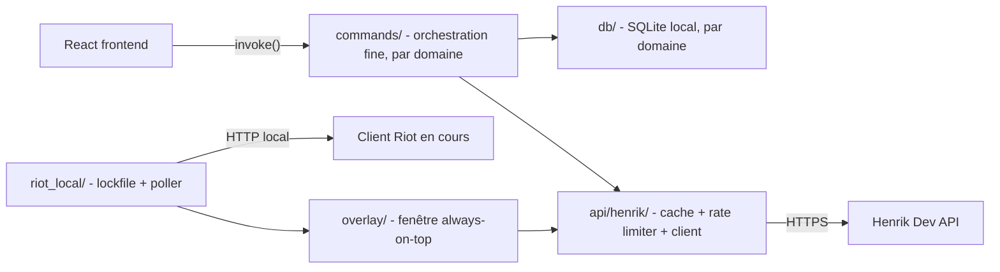

# Architecture

## Stack

- Backend : Rust (édition 2021+), Tauri 2.x, `reqwest` (rustls-tls) pour le HTTP, `rusqlite` (bundled) pour SQLite local.
- Frontend : React 18 + TypeScript, Vite, Tailwind CSS, `zustand` pour l'état réactif local, `@tanstack/react-query` pour le cache de données serveur.
- Le frontend ne parle jamais directement à l'API Henrik : tout passe par `invoke()` (`src/lib/tauriApi.ts`), miroir typé des DTO Rust.

## How it fits together

## Key decisions

- Le frontend n'appelle jamais l'API Henrik en direct (contrainte de sécurité/CSP et de cohérence du cache) — toute commande passe par `commands/` (module par domaine, voir `codebase-map.md`), fin, qui délègue à `db/`/`api/henrik/`.
- La clé API Henrik n'est jamais compilée dans le binaire distribué (extractible via `strings.exe`) — voir `integration.md` pour le mécanisme de relais.
- `AppSettings.onboarding_completed` est volontairement indépendant de `henrik_api_key_set` (ce dernier reste vrai en permanence dès qu'un proxy est compilé) — sinon le wizard d'onboarding ne s'affiche jamais sur un build de distribution.
- Certificat Authenticode auto-signé (pas de CA payante) : SmartScreen avertira toujours les utilisateurs, ce n'est pas un bug à corriger côté code.
- **Commandes toujours orchestration pure** (audit 2026-07-14) : `commands/` ne doit jamais lire le cache Henrik (`api/henrik/cache::*`) ni désérialiser un payload directement — toujours passer par une fonction dédiée dans `api/henrik/endpoints.rs` (ex. `get_cached_match_detail`, `get_cached_match_details_for_puuid`). Toute logique métier non triviale (ex. détection de streak) vit dans un module dédié (`loss_streak.rs`), jamais inline dans un handler `#[tauri::command]`.

## Gotchas

- L'API locale Riot (`riot_local/`) n'est pas documentée officiellement et peut changer sans préavis d'une patch à l'autre — repli silencieux en mode lookup manuel à préserver, jamais transformer en erreur bloquante.
- Le plein écran exclusif (pas "sans bordure") peut masquer l'overlay always-on-top — limitation Windows, pas un bug de l'app.
- Sur la machine de build, l'auto-détection `signtool.exe` de Tauri échoue (`KitsRoot10` du registre pointe vers un dossier sans `bin\`) — `signCommand` est donc en dur dans `tauri.conf.json`.
