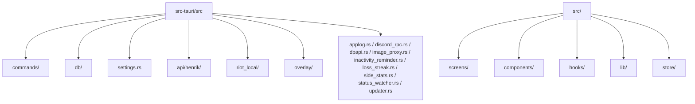

# Codebase Map

## Areas

- `src-tauri/src/main.rs` : setup Tauri, état partagé (`AppState`), enregistrement des commands, `register_shortcuts()` pour les 3 raccourcis globaux.
- `src-tauri/src/commands/` : commandes `#[tauri::command]`, orchestration fine uniquement, scindées par domaine (audit 2026-07-14) — `settings.rs` (CRUD settings, changelog, PIN, autostart, onboarding), `henrik_fetch.rs` (fetch account/mmr/matches/leaderboard/status/crosshair), `premier.rs`, `esports.rs` (VLR), `overlay.rs` (live state, shortcut status, monitors), `party_stats.rs` (duo/squad/rivalry, `record_party_from_match`, account timeline), `local_data.rs` (tracked players, favoris, snapshots, notes, goals), `self_account.rs`, `misc.rs` (logs, updater, image proxy, usage metrics). `mod.rs` garde `CommandError` + réexporte tout à plat (les commandes s'enregistrent toujours comme `commands::nom_fonction` dans `main.rs`).
- `src-tauri/src/db/` : connexion SQLite, migrations, requêtes locales, scindées par domaine de table — `players.rs` (`tracked_players`), `party.rs` (`party_matches`), `goals.rs` (`progression_goals`), `snapshots.rs` (`rank_snapshots`), `timeline.rs` (`timeline_events`), `metrics.rs` (`usage_metrics_events`). `mod.rs` garde `run_migrations`/`maybe_vacuum`/`reset_local_stats` + réexporte tout à plat.
- `src-tauri/src/settings.rs` : lecture/écriture de la config locale (clé API chiffrée DPAPI, préférences).
- `src-tauri/src/api/henrik/` : client Henrik Dev (`client.rs`), cache SQLite TTL (`cache.rs`), rate limiter + circuit breaker (`rate_limiter.rs`), une fonction par endpoint (`endpoints.rs`, `endpoints_premier.rs`, `endpoints_esports.rs`), DTO serde (`types.rs`, `types_premier.rs`, `types_esports.rs`).
- `src-tauri/src/riot_local/` : lockfile, client API locale Riot (presence/GLZ), poller de détection de partie (`poller.rs::tick()` délègue à `resolve_roster`/`fetch_pregame_roster`/`fetch_ingame_roster`/`handle_lockfile_read`/`handle_disabled`).
- `src-tauri/src/overlay/` : fenêtre overlay always-on-top, click-through, raccourci `Ctrl+Shift+V`.
- `src-tauri/src/loss_streak.rs` : détection best-effort de série de défaites + notification native, appelé depuis `commands::henrik_fetch::fetch_matches`.
- `src-tauri/src/side_stats.rs` : agrégation winrate attaque/défense à partir du cache de match déjà consulté.
- `src-tauri/src/applog.rs` : macro `applog!`, écriture du fichier de log local (`val-tracker.log`).
- `src-tauri/src/discord_rpc.rs` : Rich Presence Discord (IPC local, pas d'API réseau).
- `src-tauri/src/dpapi.rs` : chiffrement/déchiffrement DPAPI de la clé API Henrik.
- `src-tauri/src/image_proxy.rs` : récupère un logo/avatar VLR-esports tiers côté Rust, renvoyé en `data:` URI (allowlist de domaines, garde SSRF).
- `src-tauri/src/inactivity_reminder.rs` : rappel best-effort si l'app n'a pas été ouverte depuis longtemps.
- `src-tauri/src/status_watcher.rs` : surveillance périodique du statut des serveurs Henrik/Riot.
- `src-tauri/src/updater.rs` : vérification SHA256 de l'installeur en plus de la signature Ed25519 de `tauri-plugin-updater`.
- `src-tauri/proxy/` : relais Cloudflare Worker optionnel pour la distribution à un tiers (`worker.js`).
- `src/screens/` : Search, Home, Trends, Agents, MatchHistory, MatchDetail, MapStats, Compare, Settings (composition fine, voir `src/screens/settings/`), Overlay (rendue seule dans la fenêtre "overlay").
- `src/screens/settings/` : une section par domaine (`GeneralSection`, `AppearanceSection`, `LanguageSection`, `AutostartSection`, `OverlaySection`, `DiscordSection`, `CrosshairSection`, `ShortcutsSection`, `NotificationsSection`, `PrivacySection`, `UpdatesSection`, `DataSection`, `LogsSection`, `HealthSection`, `AboutSection`), `shared.tsx` pour les éléments communs (audit 2026-07-14, ex-`Settings.tsx` monolithique).
- `src/components/` : RankBadge, StatCard, RankHistoryChart, MatchRow, ErrorState, EmptyState, StaleDataBanner, ExternalImage (proxy d'images), `Home*Section` (`HomeStatusBar`, `HomeOverviewSection`, `HomeGoalsSection`, `HomeTimelineSection` — extraits de `Home.tsx`).
- `src/hooks/` : `usePlayer`, `useMatches`, `useHomeData` (React Query — fetch compte/mmr/snapshots/historique/matchs + auto-refresh, extrait de `Home.tsx`).
- `src/lib/` : `tauriApi.ts` (wrapper `invoke()`), `format.ts` (formatage KDA/%/durées/rank).
- `src/store/` : `settingsStore.ts`, `recentSearchesStore.ts` (zustand).

## Entry points

- Backend : `src-tauri/src/main.rs`.
- Frontend : `src/main.tsx` (bootstrap Vite/React), routage dans `src/screens/`.
