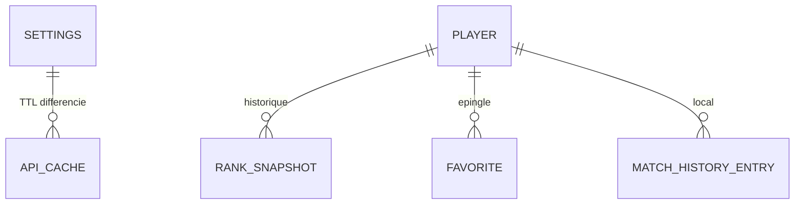

# Database

## Setup

- SQLite local via `rusqlite` (feature `bundled`, pas de dépendance système). Connexion et migrations dans `src-tauri/src/db.rs`.
- Base stockée dans le dossier de données de l'app (`%APPDATA%\com.xnooztv.val-tracker\`).

## Main entities

## Conventions

- Table `settings` : clé API Henrik chiffrée au repos via DPAPI Windows (`src-tauri/src/dpapi.rs`) — les valeurs en clair d'une version antérieure sont migrées silencieusement au premier chargement (`settings.rs::get_encrypted`).
- Table `api_cache` : cache des réponses Henrik avec TTL différenciés par endpoint (`api/henrik/cache.rs`).
- Requêtes locales (favoris, historique, snapshots de rank, `reset_local_stats`) centralisées dans `db.rs`, jamais éparpillées ailleurs.
