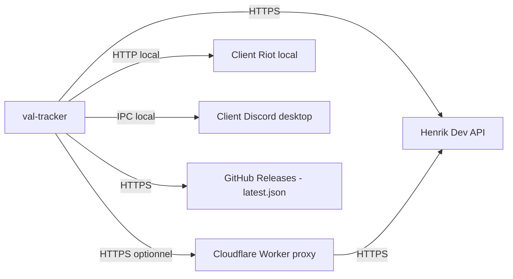

# Integration

## External services

- **Henrik Dev API** (`api.henrikdev.xyz`) : source de toutes les données Valorant (rank, MMR, matchs). Accès via `api/henrik/client.rs`, toujours cache → rate limiter/circuit breaker → client (jamais d'appel `reqwest` direct ailleurs). Quota partagé ~24 req/min, cf. `rate_limiter.rs`.
- **Relais Cloudflare Worker** (`src-tauri/proxy/`, optionnel) : détient la vraie clé Henrik côté serveur pour une distribution à un tiers sans clé perso. L'app compile seulement une URL de relais + un jeton d'accès révocable (`HENRIK_PROXY_TOKEN`) — voir `HenrikAuth` (`Direct` vs `Proxy`) dans `client.rs`. Une clé saisie par l'utilisateur dans Paramètres prime toujours dessus (mode `Direct`).
- **API locale du client Riot** : lockfile + endpoints GLZ non officiels pour la détection de partie et le roster (`riot_local/`). Non documentée par Riot, peut casser d'une patch à l'autre.
- **Client Discord desktop** : Rich Presence via IPC local (`discord-rich-presence`), identifiant d'app par défaut compilé (`DISCORD_DEFAULT_CLIENT_ID`, non secret).
- **GitHub Releases** : distribution des installeurs et source de vérité de l'auto-update (`releases/latest/download/latest.json`), endpoint public.

