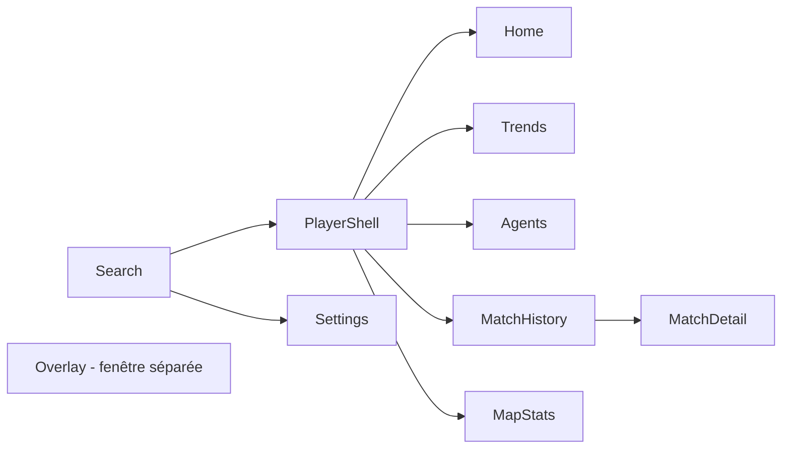

# Navigation

## Routing

- `react-router-dom` pour le routage client, écrans dans `src/screens/`.
- Deux fenêtres Tauri distinctes : la fenêtre principale (Search, Home, Trends, Agents, MatchHistory, MatchDetail, MapStats, Settings) et la fenêtre "overlay" qui rend uniquement `src/screens/Overlay.tsx`.
- Pas de notion de route protégée : pas d'authentification utilisateur, seule une clé API optionnelle conditionne l'accès aux données Henrik.

## Structure

